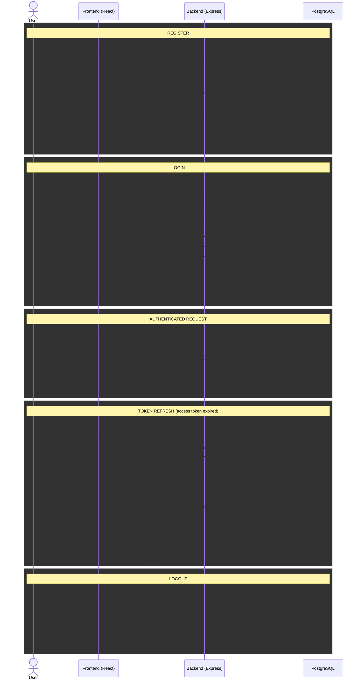

# Authentication Flow Diagram

```mermaid
sequenceDiagram
    actor User
    participant FE as Frontend (React)
    participant BE as Backend (Express)
    participant DB as PostgreSQL

    rect rgb(50, 50, 50)
        Note over User,DB: REGISTER
        User->>FE: fills register form
        FE->>BE: POST /api/auth/register {name, email, password}
        BE->>DB: SELECT * FROM users WHERE email = ?
        DB-->>BE: (no rows)
        BE->>BE: bcrypt.hash(password)
        BE->>DB: INSERT INTO users (name, email, password_hash)
        DB-->>BE: new user row
        BE-->>FE: 201 { user }
        FE->>User: redirect → /login
    end

    rect rgb(50, 50, 50)
        Note over User,DB: LOGIN
        User->>FE: fills login form
        FE->>BE: POST /api/auth/login {email, password}
        BE->>DB: SELECT * FROM users WHERE email = ?
        DB-->>BE: user row
        BE->>BE: bcrypt.compare(password, hash)
        BE->>BE: sign accessToken (15min) + refreshToken (7d)
        BE->>DB: INSERT INTO refresh_tokens (user_id, token, expires_at)
        BE-->>FE: 200 { user }<br/>Set-Cookie: access_token (httpOnly)<br/>Set-Cookie: refresh_token (httpOnly)
        FE->>User: redirect → /dashboard
    end

    rect rgb(50, 50, 50)
        Note over User,DB: AUTHENTICATED REQUEST
        User->>FE: navigates to protected page
        FE->>BE: GET /api/auth/me (cookies sent automatically)
        BE->>BE: auth_middleware reads access_token cookie<br/>verifies JWT signature & expiry
        BE-->>FE: 200 { user }
        FE->>User: render protected content
    end

    rect rgb(50, 50, 50)
        Note over User,DB: TOKEN REFRESH (access token expired)
        FE->>BE: any request → 401 Unauthorized
        FE->>BE: POST /api/auth/refresh (refresh_token cookie sent)
        BE->>BE: verify refresh JWT
        BE->>DB: SELECT * FROM refresh_tokens WHERE token = ?<br/>check expires_at > now()
        DB-->>BE: valid row
        BE->>DB: DELETE old token, INSERT new token (rotation)
        BE->>BE: sign new accessToken
        BE-->>FE: 200 { user }<br/>Set-Cookie: access_token (new)<br/>Set-Cookie: refresh_token (new)
        FE->>BE: retry original request
        BE-->>FE: original response
    end

    rect rgb(50, 50, 50)
        Note over User,DB: LOGOUT
        User->>FE: clicks logout
        FE->>BE: POST /api/auth/logout (cookies sent)
        BE->>DB: DELETE FROM refresh_tokens WHERE token = ?
        BE-->>FE: 200<br/>Set-Cookie: access_token (cleared)<br/>Set-Cookie: refresh_token (cleared)
        FE->>User: redirect → /login
    end
```
