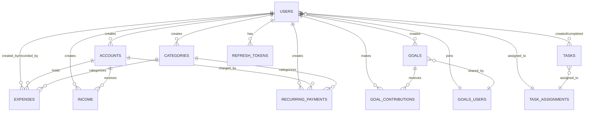

# Database Schema Documentation

## Overview

Nummus Budget is a **multi-user household finance tracker** with a normalized relational database. The schema supports:

- Multiple users in one household (no multi-tenancy)
- Fine-grained transaction tracking with audit trail
- Shared goals and household responsibilities
- Recurring payment automation

---

## Entity Relationship Diagram



---

## Core Design Decisions

### 1. **No Calculated Fields Stored**

**Decision**: Account balance is NOT a column—it's calculated from income/expenses.

**Why**:
- **Consistency**: Balance is always correct; no sync issues between stored and calculated
- **Follows 3NF**: Transitive dependency removed (balance depends on income + expenses, not stored directly)
- **Audit trail**: Every transaction is immutable; balance is derived from immutable data
- **Performance**: For a household (< 10k transactions/year), SUM queries are fast; if slow later, add materialized view

**Trade-off**: Read queries are slightly slower (must aggregate), but write queries are faster (no balance updates).

---

### 2. **Currency Lives on Accounts, Not Transactions**

**Decision**: `accounts.currency` defines currency; transactions inherit it via FK.

**Why**:
- **No duplication**: "Is this $100 USD or EUR?" is answered once (at account level), not per-transaction
- **Prevents errors**: User can't record "$100 EUR" to a USD account by mistake
- **Real-world**: Bank accounts have one currency; all transactions in them use that currency
- **Simplifies queries**: "What's my total in USD?" → filter by account currency, then SUM

**Implementation**: If a household uses multiple currencies, create separate accounts (Chase USD, BBVA COP).

---

### 3. **Dual Audit Trail on Expenses**

**Decision**: Track both `created_by` (who spent) and `recorded_by` (who logged).

**Why**:
- **Real household scenario**: Alice buys groceries; Bob logs it in the app days later
- **Accountability**: Know who made the purchase AND who recorded it
- **Dispute resolution**: If amount is wrong, know who to ask
- **Incentive**: User who logs expensive item isn't always the one who spent

**Trade-off**: Adds a column, but essential for trust in shared finances.

---

### 4. **Many-to-Many via Junction Tables**

**Decision**: Use explicit junction tables for Goals↔Users and Tasks↔Users relationships.

**Why**:
- **Flexibility**: Goals can be personal (1 user) or shared (N users) without schema change
- **Clean queries**: `SELECT * FROM goals_users WHERE goal_id = X` immediately shows who has access
- **Integrity**: Can add metadata later (e.g., `joined_at` for "when did Alice join this goal?")
- **Avoids arrays**: PostgreSQL arrays break referential integrity; join tables enforce it

**Trade-off**: Slightly more complex queries (one JOIN per many-to-many), but cleaner design.

---

### 5. **One Completion Per Task, But Many Assignees**

**Decision**: Task has `completed_by` (single user), but `task_assignments` links many users.

**Why**:
- **Real scenario**: Task "Clean kitchen" assigned to Alice & Bob. Whoever finishes marks it done for both.
- **Shared responsibility**: Prevents duplicate completions; one person finishing satisfies all assignees
- **State clarity**: If both could complete independently, queries become complex ("is task done?")

**Alternative considered**: Track per-user completion (separate `task_completion` table). Rejected as over-engineering for household chores.

---

### 6. **Household-Scoped, Not Multi-Tenant**

**Decision**: No `household_id` column. All users share everything.

**Why**:
- **Self-hosted**: You're running this on your home server; one household only
- **Simpler schema**: Fewer JOINs; faster queries; less complexity
- **No isolation bugs**: Can't accidentally leak data between households

**Future-proofing**: If multi-tenancy is needed:
1. Add `household_id` to all tables (Users, Accounts, Categories, etc.)
2. Add `UNIQUE(household_id, column)` constraints
3. Add `WHERE household_id = ?` to all queries

---

### 7. **UUID v4 for All IDs**

**Decision**: All primary keys are UUIDs (random), not sequential integers.

**Why**:
- **Decentralized**: Can generate IDs without database round-trip (good for distributed systems)
- **Privacy**: Cannot guess IDs (someone can't enumerate all expenses: 1, 2, 3, ...)
- **Natural keys**: UUID is the primary key; no separate "number" field needed

**Trade-off**: Slightly larger (16 bytes vs 8 bytes), but worth it for security & future scaling.

---

### 8. **Timestamps: Three Concepts**

**Decision**: Different timestamp columns for different purposes.

**Concepts**:
- `created_at`: When was this record inserted into the database? (always now())
- `date` (transactions): When did the event happen? (could be days ago; user-provided)
- `last_modified_at` (accounts): When was this record last updated? (for conflict detection)

**Why**:
- **Audit**: `created_at` proves when it was logged
- **Reality**: `date` captures when money actually moved (could have been recorded late)
- **Synchronization**: `last_modified_at` helps with sync across devices

---

### 9. **Goals: Contributions Tracked Separately**

**Decision**: `goal_contributions` is its own table, not a column on goals.

**Why**:
- **Multiple contributors**: N users can contribute to 1 goal (many-to-many)
- **History**: Each contribution is a record; can query contribution over time
- **Calculated progress**: Goal progress = SUM(contributions), always consistent
- **Future auditing**: Can trace who contributed what when

**Alternative considered**: Store `current_amount` on goals. Rejected: would require updates on every contribution.

---

### 10. **Recurring Payments: Rules, Not Executions**

**Decision**: `recurring_payments` stores the **rule**, not generated expenses.

**Why**:
- **Immutable history**: Once a rule is created, its definition doesn't change
- **Future execution**: A background job will generate pending expenses from these rules
- **Flexibility**: Can skip a payment, modify an amount, without deleting the rule
- **Audit**: Know the original rule intent, even if execution differs

**Future**: Separate `recurring_payments_executions` table to track which payments were generated.

---

## Relationship Patterns

### 1-to-Many (Most Common)
```
Users --creates--> Accounts
Users --creates--> Expenses
Accounts --holds--> Expenses
Categories --categorizes--> Expenses
```
Simple foreign key (FK). One side has many; other side has one.

### Many-to-Many (Flexible Relationships)
```
Users <---> Goals (via goals_users)
Users <---> Tasks (via task_assignments)
```
Explicit junction table. Enables:
- Adding metadata (`joined_at`, `assigned_at`)
- Preventing duplicates (UNIQUE constraint)
- Clear intent (this table means "has relationship")

### Audit Trail (2x FK to Same Table)
```
Expenses:
  - created_by: FK to Users (who spent)
  - recorded_by: FK to Users (who logged)
```
Same table referenced twice for different meanings. Different users may create vs record.

---

## Key Queries & Aggregations

### Account Balance
Sum all income, subtract all expenses for an account.
```
Balance = SUM(income.amount) - SUM(expenses.amount)
```

### Goal Progress
Current = SUM of contributions / target.
```
Progress = SUM(goal_contributions.amount) / goals.target_amount
```

### Expense Breakdown by Category (This Month)
Join expenses to categories, filter by date range, GROUP BY category.

### Pending Tasks with Assignees
LEFT JOIN task_assignments to get all users assigned to each task.

---

## Enums: Constrained Values

### `account_type`: `savings`, `checking`, `credit`
Prevents typos in data. Database rejects invalid types at INSERT time.

### `currency`: `USD`, `EUR`, `GBP`, `COP`
Self-hosted in Colombia → defaults to COP. Add more as needed.

### `recurring_period`: `weekly`, `monthly`, `yearly`
Standard recurrence intervals. New types require schema migration.

---

## What's NOT in the Database

### 1. **No Soft Deletes**
Records are deleted, not hidden. If audit history critical, add `deleted_at` timestamp later.

### 2. **No Budget Limits**
There's no `budgets` table. Budget enforcement can be implemented in app logic querying against actuals.

### 3. **No Notifications/Preferences**
User preferences (email alerts, etc.) would go in a future `user_preferences` table.

### 4. **No Attachments**
No receipts or files. Would need separate `attachments` table (if needed).

### 5. **No User Roles/Permissions**
All users have full access. Add `roles` table if you want tiered permissions later.

---

## How to Query This Schema

### Household Net Worth
```sql
SELECT 
  SUM(CASE WHEN account_type = 'savings' THEN balance ELSE 0 END) as savings,
  SUM(CASE WHEN account_type = 'checking' THEN balance ELSE 0 END) as checking,
  SUM(CASE WHEN account_type = 'credit' THEN balance ELSE 0 END) as debt
```

### Expenses Breakdown (Last 30 Days)
```sql
GROUP BY categories.name
WHERE expense.date >= NOW() - INTERVAL '30 days'
ORDER BY total DESC
```

### Who's Contributing Most to Each Goal
```sql
SELECT goal_id, users.name, SUM(goal_contributions.amount)
GROUP BY goal_id, users.name
ORDER BY SUM DESC
```

### Overdue Tasks with Owners
```sql
SELECT tasks.title, ARRAY_AGG(users.name)
FROM tasks
LEFT JOIN task_assignments ON tasks.id = task_assignments.task_id
LEFT JOIN users ON task_assignments.user_id = users.id
WHERE tasks.due_date < NOW() AND tasks.completed_at IS NULL
GROUP BY tasks.id
```

---

## Migration & Deployment

### Development Workflow
1. Modify schema in `apps/backend/src/db/schema.ts` (Drizzle ORM)
2. Run `npm run db:generate` → generates migration SQL
3. Run `npm run db:migrate` → applies to database
4. Verify in `npm run db:studio` (GUI)

### Enums
PostgreSQL enums are created at migration time. To add a new enum value:
1. Update enum in schema.ts
2. Run generate/migrate
3. Drizzle will ALTER TYPE (or create new type if required)

---

## Performance Considerations

### Current Priorities (Household Scale)
- < 10k transactions/year is small; indexes not critical yet
- Aggregation queries (SUM, COUNT) are fast on < 100k rows
- Full table scans acceptable at this scale

### Future Optimizations (If Needed)
- Add INDEX on `created_at`, `account_id`, `category_id` (common filters)
- Materialized VIEW for `monthly_expenses_by_category` (if slow)
- Partition by year for very large datasets
- Read replica for reporting queries

---

## Summary: Why This Design

This schema is built for a **single household** where:
1. **Trust is assumed**: Users aren't malicious; audit is for accountability, not security
2. **Simplicity is preferred**: No over-engineering for future scale that may never come
3. **Correctness matters**: Calculated fields (balance, goal progress) are derived, not stored
4. **Flexibility is needed**: Users may be shared or personal; contributors can change
5. **Ownership is tracked**: Who created, who recorded, who completed—matters in a family

The design prioritizes **data integrity** (3NF normalization) and **auditability** (timestamps, dual tracking) over performance, because this is a household app, not a financial institution.
